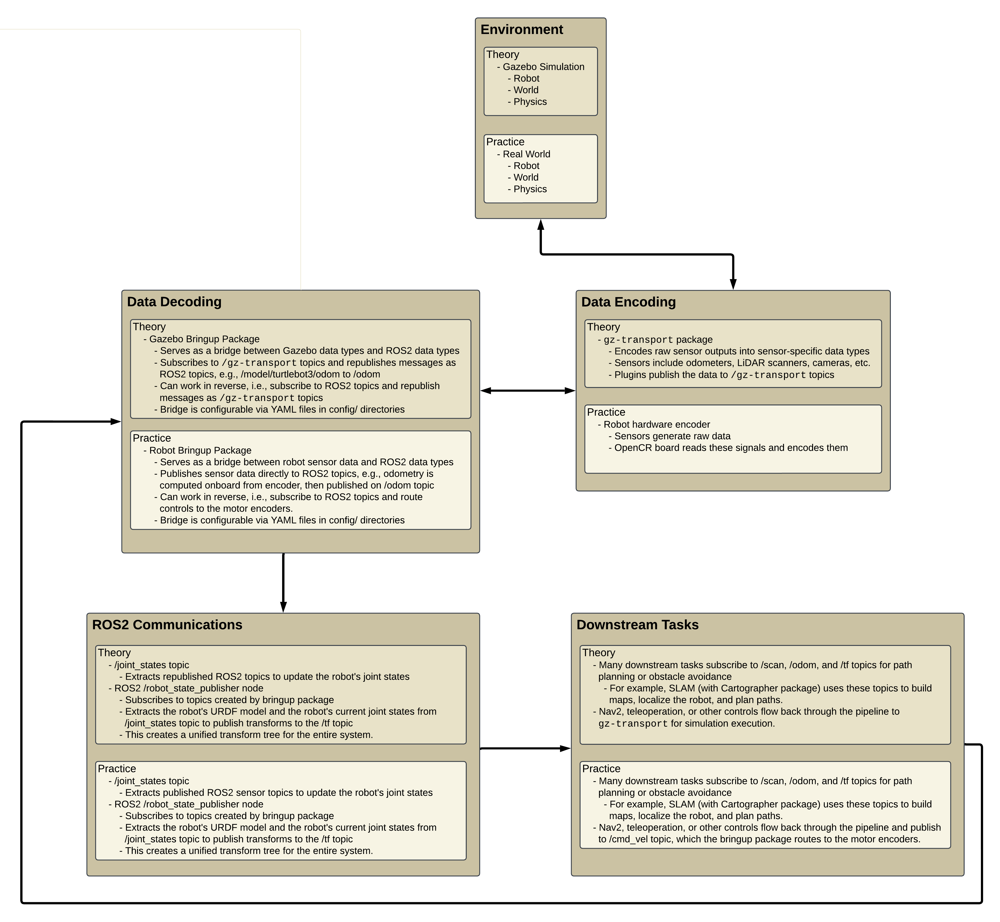

# ROS2 Jazzy Gazebo Custom Robot Simulation

Take note of `ros2_cheatsheet.pdf`, since it will be very helpful. Additionally, `my_robot_frames.pdf` shows the correct hierarchy of links and joints for the custom robot in this repository.

## ROS2 Workflow Description:



## ROS2 RQT Graph Visualization:


## Installation

Jazzy is the current LTS distro for ROS2. If a new LTS distro is released, chances are it is backwards compatible, meaning you can replace `jazzy` with the name of the new distro `<distro>` in the following steps. For example, replace `sudo apt install ros-jazzy-ros-gz` with `sudo apt install ros-<distro>-ros-gz`.

Dual booting Ubuntu is recommended when operating Gazebo Ionic. These steps assume you have Ubuntu 24.04.3 LTS installed as your OS.

### 1. Install ROS2 Jazzy. 

1. (a) Navigate to `https://docs.ros.org/en/jazzy/Installation/Ubuntu-Install-Debs.html`

1. (b) Alternatively, search for `ros2 jazzy install` in your browser and navigate to `deb packages` under Ubuntu Linux.

2. Follow the guidelines for installing ROS2 Jazzy distribution. Opt for the recommended desktop installation and make sure to install the optional development tools.

3. Add the following to the end of your .bashrc

   ```
   export TURTLEBOT3_MODEL=burger # can be burger or waffle
   export GZ_SIM_RESOURCE_PATH=/path/to/ros2_tf_urdf_rviz_gazebo/src/custom_robot_bringup/models:${GZ_SIM_RESOURCE_PATH}
   source /opt/ros/jazzy/setup.bash
   source /path/to/ros2_tf_urdf_rviz_gazebo/install/setup.bash
   ```

### 2. Install Gazebo Ionic (latest version of Gazebo)

`sudo apt install ros-jazzy-ros-gz`

### 3. Install xacro for improved URDF functionality

`sudo apt install ros-jazzy-xacro`

### 4. Install the Navigation 2 Stack and Turtlebot3 packages

`sudo apt install ros-jazzy-navigation2 ros-jazzy-nav2-bringup ros-jazzy-turtlebot3*`

### 5. Install SLAM toolbox

`sudo apt install ros-jazzy-slam-toolbox`

### 6. Install git and clone repository.

```
sudo apt install git
git clone git@github.com:adossantos21/ros2_tf_urdf_rviz_gazebo.git
```

### 7. Make `ros2_tf_urdf_rviz_gazebo` your current directory and build the package:

`colcon build --symlink-install`

### OPTIONAL
If colcon is not recognized, check if you have it installed by running: `sudo apt install python3-colcon-common-extensions`
